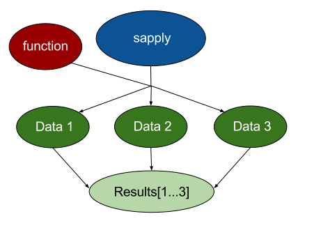
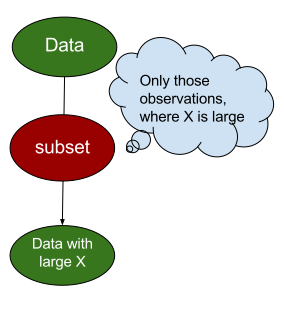
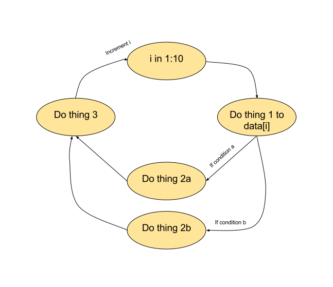
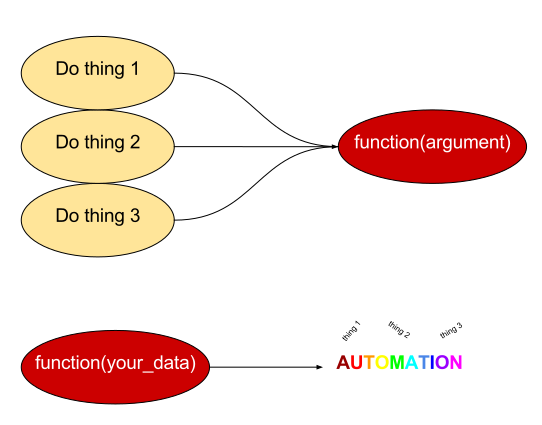

# Automating repetitive tasks

## *apply: apply the same function to many datasets

```{r echo=FALSE, out.width=700}

```

## Subsetting with logical tests
```{r echo=FALSE, out.width=500}

```

## For-loops
```{r echo=FALSE, out.width=700}

```

## Creating your own functions
```{r echo=FALSE, out.width=700}

```
